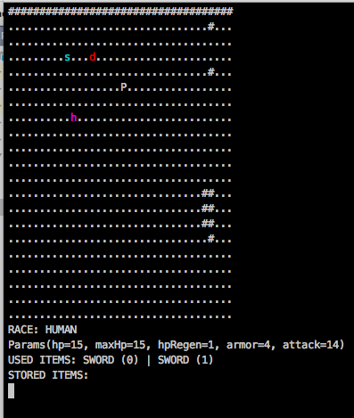
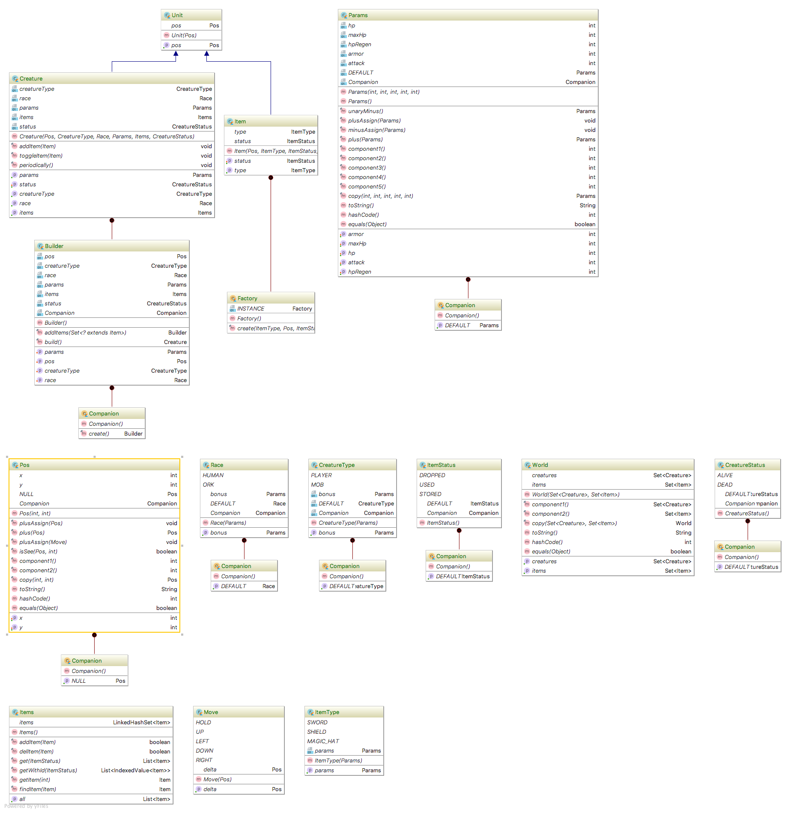
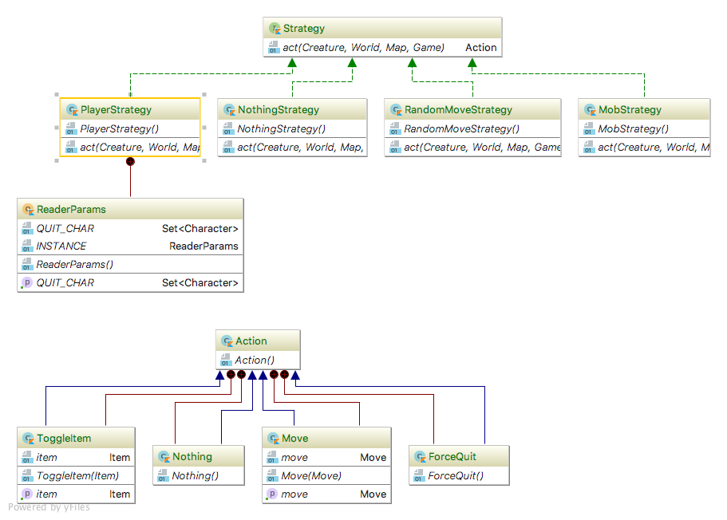
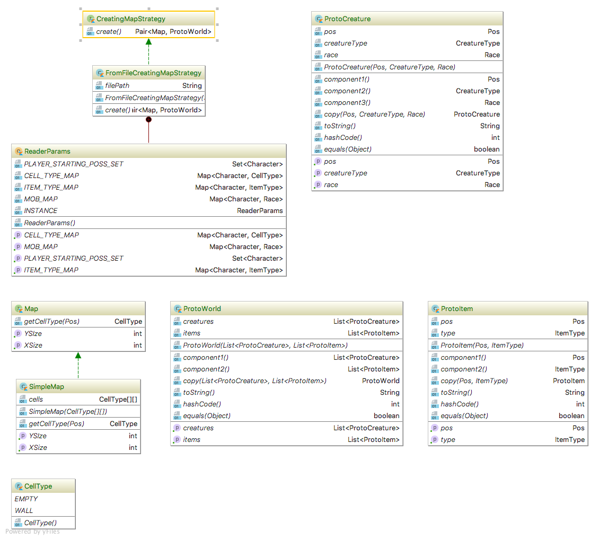
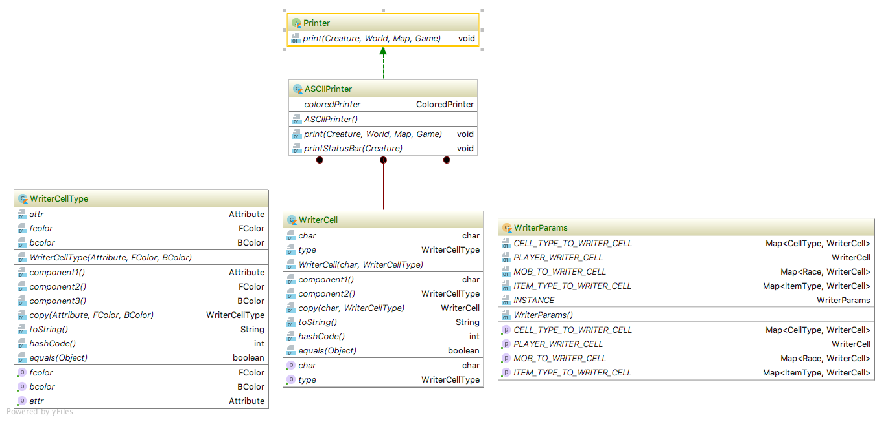
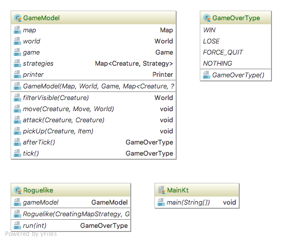
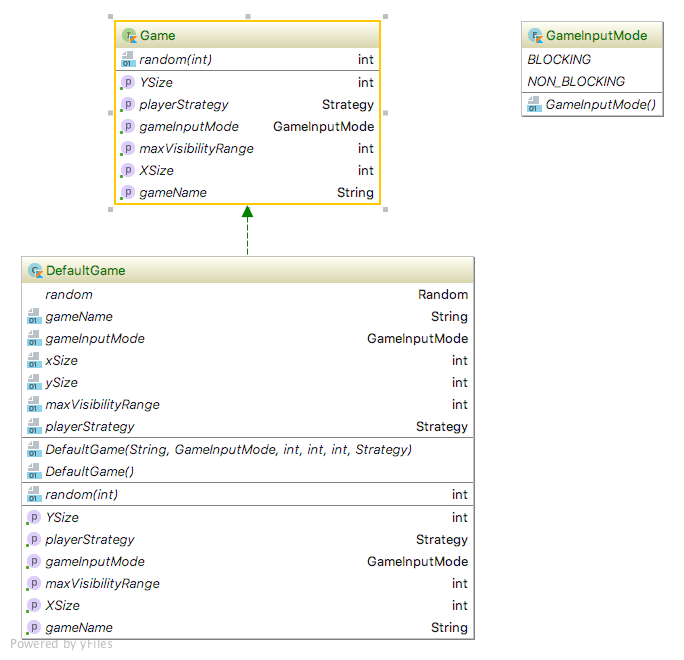

# Roguelike

## Build

Run `./gradlew build` to build whole project (include dokka and testing).

## Doc

[Некое подобие документации](https://github.com/StasBel/sd-homework/blob/Roguelike/dokka/sd-homework/index.md)

## Input

### Modes

Есть два мода - `BLOCKING` и `NON_BLOCKING`.  Отличаются тем, что `BLOCKING` ждет `enter` после
каждой введенной строки, а `NON_BLCOKING` - нет, но его надо обязательно запускать с нативного
терминала, в IDE не работает.

### Controls

`n` for `Nothing`

`h` for `Hold`

`w`, `a`, `s`, `d` for `Moving`

`q`, `Q`, `27` for `ForceQuit`

`i<num>`, `t<num>` for `ToggleItem`

## Assumption

Сейчас стартегиям и принтерам передаются сущности с `public`-сеттерами в предположении
того, что все наши стратегии и принтеры правильно реализованы. Если бы требовалось предоставить кому-нибудь
возможность написать свою стратегию для этой игры, то все поля в сущностях получилил бы `internal`-сеттеры.

## Screen

## Patterns

1. Builder и Фабрика для создания `Creature` и `Item` соответственно.
2. Стратегия для реализации стратегий создания начальной конфигурации, 
выбора способа вывода, а также стратегия перемещения `Creatures`.

## Diagrams

