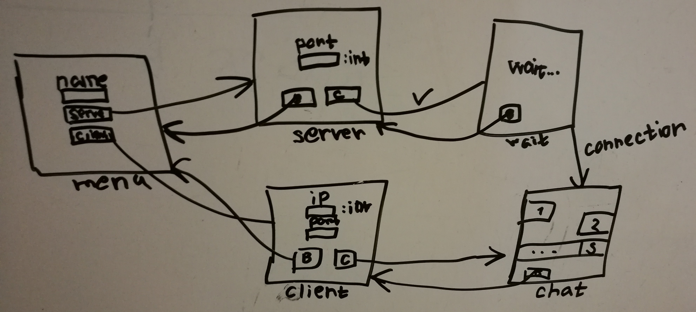

# Messenger

## Overall

pattern: MVC

[Некое подобие документации](https://github.com/StasBel/sd-homework/blob/InstantMessenger/dokka/sd-homework/index.md)

## Model

`Model` это отдельный класс, который реализует интерфейс `createServer(port), createClinet(ip, port)`.
В результате создаются экземпляры класса `ChatSocker` 
с методами `isOpen: Boolean, sendMessage(msg), getMessage(): msg, close()`.

Передаю по `TCP`. Используется `Google Protobuf`. 
Есть кастомные `exceptions`. Полная документация.

## View

В этот модуль вынесена вся логика рисования gui.
Есть view-шки, примитивы и главный класс `View`, наследующийся от `JFrame`

## Control

Реализует основную логику программы. Для каждой вьюшки есть свой контрол,
который хранит ее как поле и добавляет слушателей на кнопки и действия.
Помимо этого есть основной `Control`, хранящий обшие для всех поля.

## GUI

## Other

Общаться ни с кем не пробовал, но вроде все должно работать.