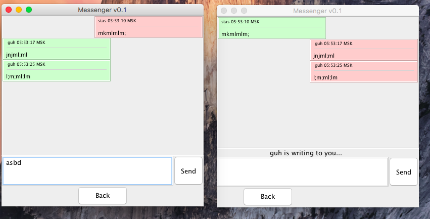

# Messenger

## gRPC & Build

Run `./gradlew generateProto` to generate Proto files.

Run `./gradlew build` to build project.

Run `./gradlew test` to test project.

Run `./gradlew dokka` to make doc-file.

## Overall

pattern: MVC

[Некое подобие документации](https://github.com/StasBel/sd-homework/blob/gRPC/dokka/sd-homework/index.md)

## Model

Сделал изменения в `Protobuf`-файле: добавил сервис grpc, отдельное сообщение для
`UserInfo`(имя) и пустое сообщение для нотификации о письме. Добавился отдельный 
интерфейс для `Client`, в методы для установки соединения для `Server` и `Client` добавил интерфейс `ChatListener`
для обработки входящих запросов. Внутренняя логика слегка поменялась (gRPC).
Интерфейс `ChatSocket` и его реализация заменились на `Writer` и его реализацию
(тоже в связи с переходом на gRPC).

## View

Небольшие изменения в `ChatView` (добавил `JLabel` для нотификации о письме).

## Control

Слегка поменял `ChatControl`, который реализует интерфейс `ChatListener`
(то есть именно он обрабатываем все входящие ззапросы, то есть именно его методы
дергает `gRPC`). Пришлось поле `Writer`'a инициализировать не в конструкторе, а с
поздней инициализацией в методе `startChar(writer: Writer)` 
(благо к `Kotlin`'e есть специальный модификатор `lateinit`)

## GUI

## Other

Общаться ни с кем не пробовал, но вроде все должно работать.