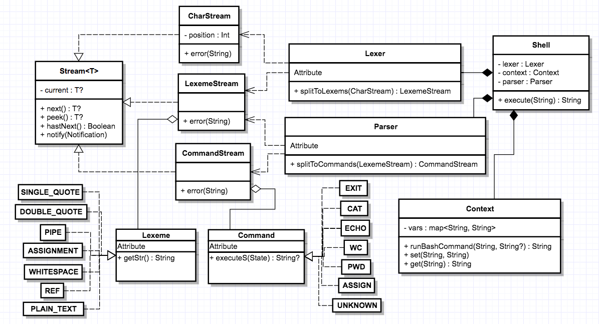

Есть базовый абстрактный класс Stream, от которого наследуются CharStream, LexemeStream и CommandStream, которые реализуют функционал обертки для входной строки, разбиения на лексемы и парсинга соответственно.
Переход между стримами делается в Lexer и Parser, которые используются в Shell вместе c Context.